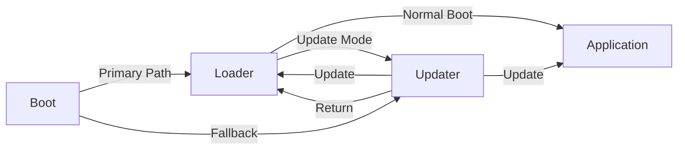
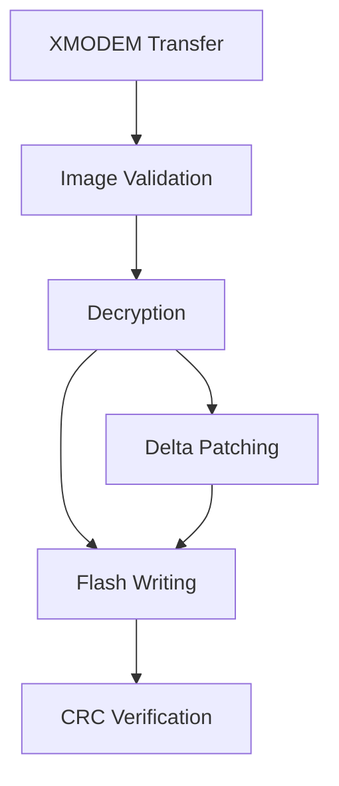

   


# STM32F4 Secure Bootloader

A comprehensive, multi-stage secure bootloader system for STM32F4 microcontrollers with support for secure firmware updates, delta patching, and encryption.

## Overview

This project implements a robust four-stage bootloader solution for STM32F4 microcontrollers, featuring:





### Components

1. **Boot** (16KB from 0x08000000): Primary bootloader that validates and hands off to Loader.
2. **Loader** (48KB from 0x08004000): Interactive menu-based bootloader for normal boot or update selection.
3. **Updater** (64KB from 0x08010000): Handles firmware updates via XMODEM with encryption and delta patching.
4. **Application** (384KB from 0x08020000): Main application firmware.

### Key Features

- **Structured Image Headers**: Firmware validation using magic numbers and CRC32
- **Secure Updates**: AES-128-GCM encryption via 
- **Delta Patching**: Efficient firmware updates using 
- **XMODEM Protocol**: Reliable firmware transfer over UART
- **Failsafe Design**: Backup and recovery mechanisms
- **Version Control**: Version verification during updates
- **CMake-based Build System**: Flexible and configurable builds

## Project Structure

```
├── application/         # Main application code
├── boot/                # Primary bootloader
├── cmake/               # CMake configurations
├── common/              # Shared code between components
│   ├── inc/             # Common headers
│   └── src/             # Common source files
├── drivers/             # STM32 HAL and peripheral drivers
│   ├── CMSIS/           # CMSIS files
│   ├── STM32F4xx_HAL_Driver/ # STM32 HAL
│   └── ThirdParty/      # Third-party libraries
│       ├── JANPATCH/    # Delta patching library
│       └── mbedTLS/     # Encryption library
├── linker/              # Linker scripts for each component
├── loader/              # Second-stage bootloader
├── MBEDTLS/             # mbedTLS configuration
├── scripts/             # Utility scripts
└── updater/             # Update manager component
```

## Memory Layout

| Component    | Address Range               | Size    | Description                      |
|--------------|----------------------------|---------|----------------------------------|
| Boot         | 0x08000000 - 0x08003FFF    | 16KB    | Primary bootloader               |
| Loader       | 0x08004000 - 0x0800FFFF    | 48KB    | Menu-based bootloader            |
| Updater      | 0x08010000 - 0x0801FFFF    | 64KB    | Update manager                   |
| Application  | 0x08020000 - 0x0807FFFF    | 384KB   | Main application                 |
| Backup       | 0x08080000 - 0x080BFFFF    | 256KB   | Backup region for updates        |
| Patch        | 0x080C0000 - 0x080FFFFF    | 256KB   | Temporary storage for patches    |

## Image Header Structure

Each firmware component includes a 512-byte (0x200) header with the following structure:

```c
typedef struct __attribute__((packed)) {
    uint32_t image_magic;
    uint16_t image_hdr_version;
    uint8_t  image_type;
    uint8_t  is_patch;
    uint8_t  version_major
    uint8_t  version_minor;
    uint8_t  version_patch;
    uint8_t  _padding;
    uint32_t vector_addr;
    uint32_t crc;
    uint32_t data_size;
    uint8_t  reserved[0x1E0];
} ImageHeader_t;
```

Component-specific magic numbers:
- Loader: `0xDEADC0DE`
- Updater: `0xFEEDFACE`
- Application: `0xC0FFEE00`

## Prerequisites

- ARM GNU Toolchain (I used )
- CMake 3.22 or higher
- Python 3.6+ with virtual environment
- STM32CubeProgrammer (included in STM32CubeCLT)
- Required Python packages:
  - Dependencies in requirements.txt

## Build Instructions

### Setup Python Environment

```bash
python -m venv .venv
source .venv/bin/activate
pip install -r requirements.txt
```

### Configure and Build

```bash
mkdir build && cd build
cmake ..
make
```

### Build Targets

- `boot_debug`: Build the primary bootloader
- `loader_debug`: Build the menu-based bootloader
- `updater_debug`: Build the update manager
- `app_debug`: Build the application
- `patch_and_merge`: Create patched firmware images and merge into a single binary
- `encrypt_app`: Encrypt the application firmware
- `encrypt_updater`: Encrypt the updater firmware
- `encrypt_loader`: Encrypt the loader firmware
- `flash_full`: Flash the merged firmware to the device

### Flashing

```bash
# Flash the complete firmware image
make flash_full

# Or using STM32CubeProgrammer directly
STM32_Programmer_CLI -c port=swd mode=UR -d build/merged_firmware.bin 0x08000000 -v -hardRst
```

## Firmware Update Process

### Full Image Update

1. Boot the device into Loader
2. Select Updater mode
3. Choose the component to update (loader or application)
4. Send the encrypted firmware over XMODEM (if encryption is enabled)
5. The Updater validates, decrypts, and flashes the new firmware

### Delta Patch Update

1. Boot the device into Updater
2. Choose the component to patch
3. Send the encrypted delta patch over XMODEM
4. The Updater:
   - Decrypts the patch
   - Backs up the existing firmware
   - Applies the delta patch
   - Verifies the CRC
   - Finalizes the update or restores from backup on failure

## Utility Scripts

### merge_images.py

Merges individual component binaries into a single firmware image.

```bash
python scripts/merge_images.py build boot.bin loader.bin updater.bin app.bin --output merged_firmware.bin
```

### encrypt_firmware.py

Encrypts firmware binaries using AES-128-GCM.

```bash
python scripts/encrypt_firmware.py encrypt firmware.bin encrypted_firmware.bin
```

### create_patch.py

Creates a delta patch between two firmware versions using jdiff tool.

```bash
python scripts/create_patch.py -e old_firmware_patched.bin new_firmware_patched.bin output_diff_file_with_header_attached.bin
```

## Security Features

### Encryption

- **Algorithm**: AES-128-GCM
- **Implementation**: 
- **Key Storage**: Default key in binary (can be customized, but has to be consister with encryption script as well)
- **Data Protection**: Encrypted firmware with authentication tag

### Firmware Validation

Each firmware image is validated using:
1. Component-specific magic number
2. CRC32 checksum verification
3. Version number checks
4. Image type verification

### Secure Boot Chain

The secure boot chain ensures that only validated firmware components are executed:

1. Boot validates and starts Loader (or Updater as fallback)
2. Loader validates and starts Application (or enters update mode)
3. Updater validates all firmware images before flashing

## Delta Patching

The delta patching feature allows for efficient firmware updates by transferring only the differences between firmware versions:

1. Create a patch between old and new firmware using `create_patch.py`
2. Transfer the encrypted patch to the device using XMODEM
3. The Updater decrypts and applies the patch using the  library
4. The patched firmware is validated using CRC32

Benefits:
- Reduced transfer time and bandwidth
- Lower power consumption during updates
- Less flash write wear

## UART/XMODEM Protocol

The XMODEM implementation features:
- XMODEM-CRC protocol
- 128-byte data packets
- Retry mechanism
- Error detection and handling
- Integration with encryption/decryption

## License

Please refer to individual component license files for licensing information.
- STM32 HAL driver components: BSD-3-Clause license
- CMSIS components: Apache License 2.0
- ThirdParty components: See respective license files